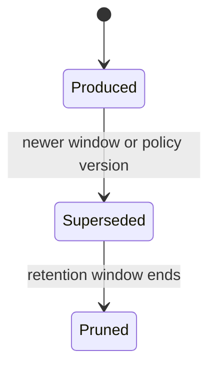

# Analytics Schema v1

Logical schema for the Analytics context. Raw events and derived aggregates are stored separately, and every derived record can name the inputs and policy that produced it.

## Entities

| Entity | Key fields | Constraints |
| --- | --- | --- |
| IngestedEvent | `eventId`, eventType, `learnerId`, occurredAt, payloadRef | Deduplicated by `eventId`; immutable; partitioned by time. |
| AggregationPolicy | `policyId`, version, metricFamily, definition, status | Immutable after publication; new formula means new version. |
| MetricSnapshot | `snapshotId`, `learnerId`, metricKey, value, window, policyVersion, watermark | Reproducible from raw events; superseded rather than edited. |
| InsightRule | `ruleId`, version, condition, evidenceRequirements, status | Versioned like aggregation policies; anchors insight explainability. |
| Insight | `insightId`, `learnerId`, ruleVersion, claim, evidenceRefs, confidence, status | Requires evidence references; expires or is superseded by newer snapshots. |

## Integrity Rules

1. Ingestion is idempotent: an event ID is processed at most once per aggregation policy version.
2. Raw events are never modified or selectively deleted for analytic convenience; learner deletion requests propagate through the same verified workflow as Memory.
3. A snapshot without a policy version and watermark is invalid; recomputation with the same inputs must be bit-identical.
4. Insights must reference the snapshots or events that justify them; an insight whose evidence is deleted is withdrawn.
5. Metric definitions shown to learners come from the policy record, so the display and the computation cannot diverge.
6. No Analytics read model exposes another learner's identifiable data; cohort features require explicit consent bases before design.
7. Analytics outputs are advisory: consumers record their own decision when acting on an insight, preserving ownership boundaries.

## Snapshot Lifecycle

## Event Publication

| Event | Trigger |
| --- | --- |
| `InsightProduced.v1` | An insight rule fires with satisfied evidence requirements. |

## Retention

Raw ingested events follow the platform's time-partitioned retention strategy. Snapshots are kept while any learner-facing view, insight, or plan decision references them; pruning is policy-driven and logged. Aggregation and insight-rule versions are never deleted, because reproducing a historical number requires the policy that computed it.
