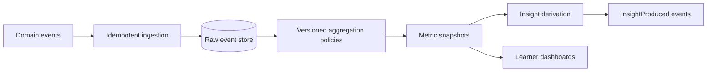

# Analytics v1

## Purpose

Analytics turns the event stream—sessions, plans, attempts, evaluations, revisions, notifications—into reproducible progress evidence: metrics for the learner, insights for the Planner and Secretary, and honest signals about whether preparation is working. It owns the Analytics context: MetricSnapshot and Insight.

## Scope and Boundaries

Analytics owns derived data only. It consumes other contexts' events; it never mutates their state, and nothing in Analytics is a source of truth for anything except its own aggregates. Learners cannot edit metrics, and no module treats an insight as a command—insights inform, owners decide.

## Processing Model

Ingestion deduplicates by event ID and preserves raw events separately from aggregates, so any metric can be recomputed from first principles. Aggregation runs under a versioned policy; a `MetricSnapshot` records the policy version, input window, and event watermark that produced it. Changing a formula means a new policy version and recomputation—never silent redefinition of an existing metric.

## Core Metric Families

| Family | Examples | Primary consumers |
| --- | --- | --- |
| Consistency | Study streaks, planned-vs-actual hours, commitment completion rate | Learner, Planner, Secretary |
| Coverage | Syllabus concepts touched, depth per paper, neglected-area age | Learner, Planner |
| Performance | Score trends by paper and criterion, accuracy by difficulty | Learner, Planner, Examiner calibration |
| Retention | Revision completion, recall performance over intervals | Revision, Planner |
| Engagement health | Session abandonment, replan churn, notification response | Product operations |

Metrics are tenant-scoped. Cross-learner comparison exists only as future consent-based cohorts, per the module map.

## Insights

An Insight is an explainable, derived observation—"Polity answer scores have declined across the last three sectional tests, concentrated in the 'structure' criterion"—produced by versioned rules over snapshots. Every insight carries its evidence references, the rule version that produced it, and a confidence level. Publishing emits `InsightProduced.v1` for the Planner and Secretary. Model-generated narrative may phrase an insight for the learner, but the underlying claim comes from the rule engine and its cited evidence, not from the model.

## Query Contracts

| Consumer | Request | Result |
| --- | --- | --- |
| Learner | Progress dashboard | Metric snapshots with policy version and evidence drill-down. |
| Planner | Signals for a replan decision | Insights and snapshots scoped to the plan horizon. |
| Secretary | Talking points for check-ins | Recent insights with plain-language evidence. |
| Examiner | Calibration data | Score distributions by rubric version, no learner identities beyond scope. |

## Quality and Success Metrics

Analytics measures itself: recomputation determinism (same events and policy produce identical snapshots), ingestion lag against event watermarks, insight precision judged by learner and planner action rates, and the share of displayed numbers that can produce their evidence trail on demand. A dashboard number that cannot explain itself is a bug, not a feature.
