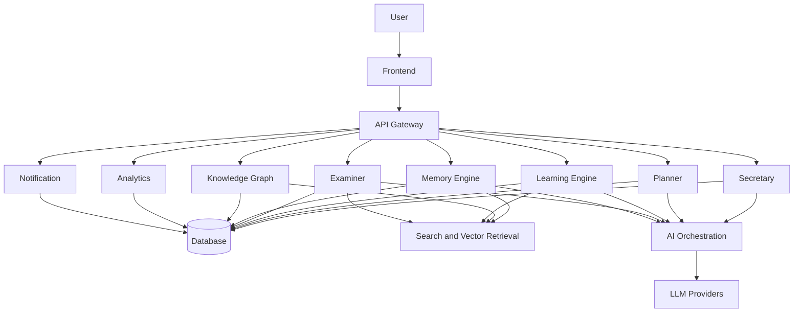

# Lakshya Core Architecture v1

## Vision

Lakshya Core (UPSC OS) is an AI operating system for UPSC aspirants. It turns goals, study activity, performance, and evolving knowledge into timely, explainable guidance. It is a personal mentor, planner, teacher, examiner, researcher, secretary, and durable learning memory—not merely a study app.

## Product Goals

| Goal | Architectural implication |
| --- | --- |
| Personalised preparation | Preserve learner context and make it retrievable across modules. |
| Reliable daily execution | Keep planning, reminders, and session tracking independently operable. |
| Pedagogically useful AI | Ground model outputs in curated sources and learner evidence. |
| Measurable improvement | Capture outcomes and expose them through feedback loops. |
| Trust and control | Make recommendations explainable and overrideable by the learner. |

## High-Level Architecture

The frontend presents product capabilities; it does not contain authoritative business rules. The API Gateway authenticates, authorises, validates, and routes requests. Domain modules own workflows and publish meaningful events. Storage, retrieval, and model providers are accessed through explicit infrastructure adapters.

## Technology Stack

| Area | v1 direction | Rationale |
| --- | --- | --- |
| Frontend | TypeScript web application | Typed, accessible learner experience. |
| Backend | Modular TypeScript service API | Shared language and clear domain boundaries. |
| Database | PostgreSQL | Transactional learner data and relational integrity. |
| Search | PostgreSQL full-text initially; dedicated search later | Avoid premature operations complexity. |
| Vector retrieval | pgvector initially | Co-locates embeddings with learner data. |
| Authentication | OAuth/OIDC provider | Delegates credential security and supports future identities. |
| Hosting | Managed cloud containers and database | Reproducible deployment with low operations load. |
| Observability | Structured logs, metrics, traces, error tracking | Diagnoses synchronous and AI workflows. |
| AI models | Provider-agnostic orchestration | Enables model selection, evaluation, and change. |

## Core Principles

- Each module owns one business capability and a narrow contract.
- AI augments deterministic workflows; it is not the source of truth for identity, schedules, or scores.
- Learner data is explicit, consent-aware, traceable, and purpose-limited.
- Events communicate completed facts; synchronous calls serve immediate user needs.
- Human intent wins: learners may edit plans, reject suggestions, and correct memory.

## Scalability Strategy

Begin as a modular monolith with one relational database, preserving module boundaries, event schemas, and adapter interfaces. Scale reads through caching and replicas; move embeddings, quiz generation, analytics aggregation, and notification delivery to workers. Extract a module only when workload, data isolation, or independent deployment justifies the operational cost. Partition high-volume activity data by time and retain raw events separately from derived aggregates.

## Security Considerations

Apply least privilege, tenant scoping on every learner-data query, encryption in transit and at rest, external secret management, gateway validation, rate limiting, and audited privileged actions. Treat prompts, retrieved context, and model responses as untrusted input: minimise disclosed context, defend against prompt injection, and avoid unnecessary personal data in provider requests. Define retention and deletion before collecting durable memory.

## Future Evolution

V1 establishes a modular monolith, event contracts, and AI orchestration. Later iterations may add a curriculum pipeline, evaluator-driven model routing, graph-aware planning, offline-first clients, mentor workflows, multilingual instruction, and independently deployed workers. Evolution must preserve public contracts, memory migration paths, and measurable AI quality gates.
