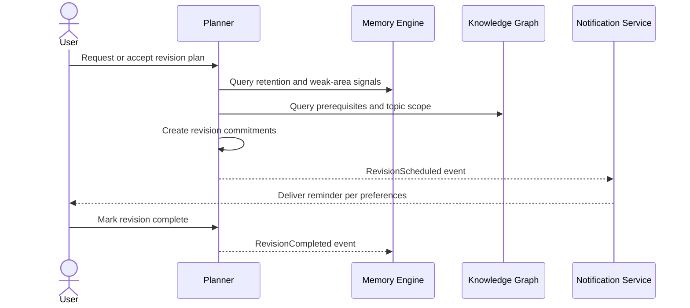
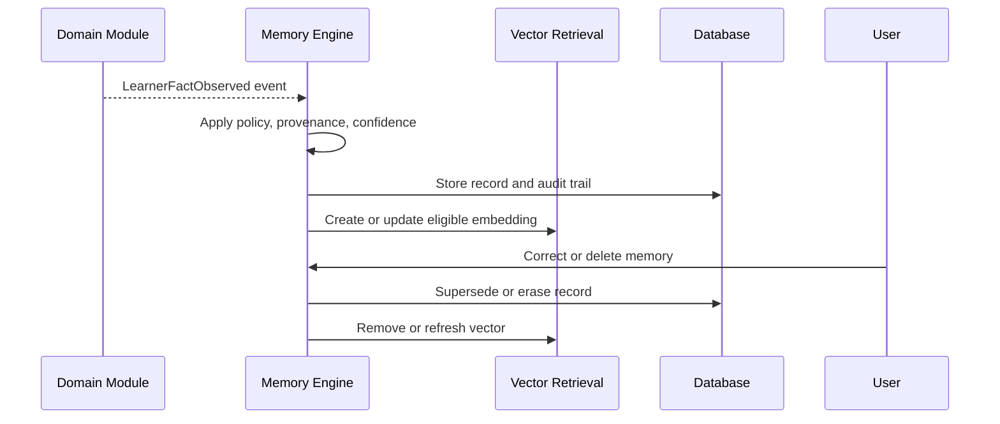
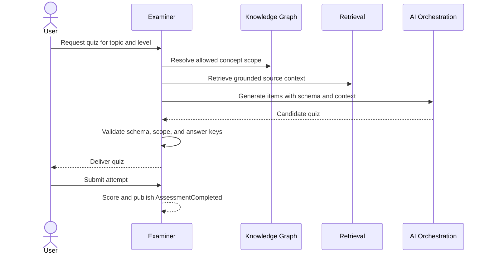
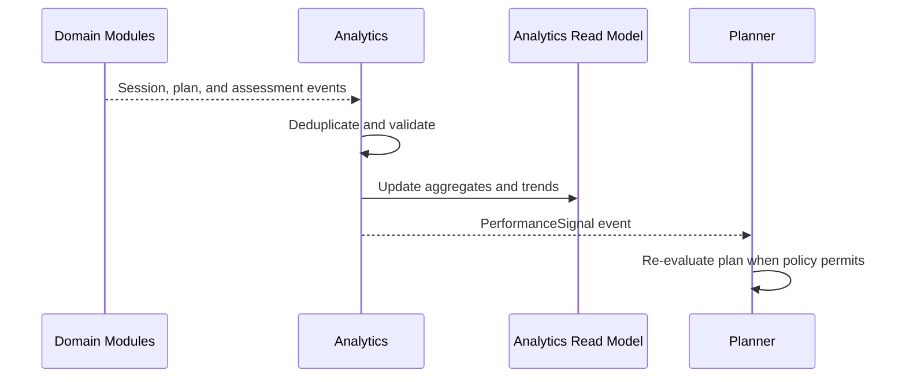
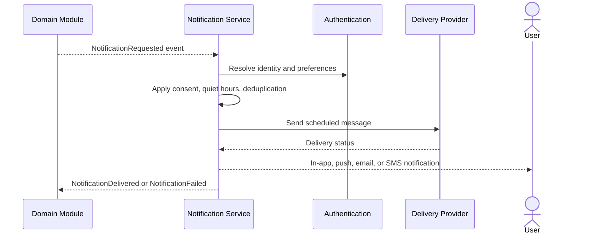

# Data Flows

Flows publish business facts after their transaction succeeds. Delivery is at-least-once, so consumers must be idempotent. Correlation IDs connect work across synchronous and asynchronous boundaries.

## Study Session Flow

```mermaid
sequenceDiagram
    actor U as User
    participant F as Frontend
    participant G as API Gateway
    participant L as Learning Engine
    participant M as Memory Engine
    participant A as Analytics
    U->>F: Start and complete study session
    F->>G: Submit session activity
    G->>L: Authorised command
    L->>L: Validate and persist session
    L-->>M: SessionCompleted event
    L-->>A: SessionCompleted event
    M->>M: Update memory candidates
    A->>A: Update progress aggregates
    G-->>F: Session summary
```

## Revision Flow

## Memory Update Flow

## Quiz Generation Flow

## Analytics Flow

## Notification Flow

