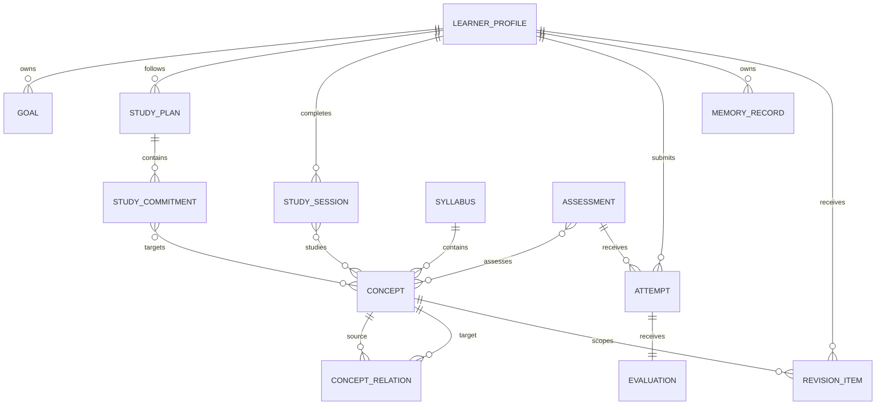

# Domain Model v1

## Purpose

The domain model gives Lakshya Core a stable vocabulary and ownership model before application code is introduced. It represents UPSC preparation as a sequence of learner decisions, planned work, learning activity, assessment evidence, and revision—not as a stream of chat messages.

## Modelling Rules

- Every aggregate is owned by one bounded context.
- Identifiers are opaque and stable; timestamps use UTC.
- Learner-owned records are tenant-scoped and auditable.
- Derived AI output is never a source of truth without provenance and validation.
- Cross-context state changes are communicated as versioned domain events.

## Bounded Contexts

| Context | Owns | Key aggregates |
| --- | --- | --- |
| Identity | Learner identity, roles, consent, preferences | LearnerProfile, ConsentRecord |
| Planning | Goals, availability, study plans, commitments | Goal, StudyPlan, StudyCommitment |
| Learning | Study activity, resource use, progress observations | StudySession, LearningResource, ProgressObservation |
| Knowledge | Shared syllabus taxonomy and concept relationships | Syllabus, Concept, ConceptRelation |
| Assessment | Question sets, attempts, rubric-based evaluation | Assessment, Attempt, Evaluation |
| Memory | Learner-specific durable context and retrieval policy | MemoryRecord, MemoryCorrection |
| Revision | Scheduled recall and completed revision activity | RevisionSchedule, RevisionItem |
| Analytics | Derived metrics and explanatory insights | MetricSnapshot, Insight |
| Notification | Delivery requests and delivery outcomes | NotificationRequest, DeliveryRecord |

## Aggregate Reference

| Aggregate | Identity | Lifecycle | Invariants |
| --- | --- | --- | --- |
| LearnerProfile | `learnerId` | Created at registration; updated by learner or authorised support | One profile per learner; preferences never grant authorisation. |
| Goal | `goalId` | Draft → active → completed, paused, or abandoned | Has a learner owner, target date or explicit open-ended status, and measurable outcome. |
| StudyPlan | `planId` | Draft → active → superseded, completed, or archived | At most one active plan for a learner and planning horizon. |
| StudyCommitment | `commitmentId` | Proposed → scheduled → completed, skipped, deferred, or cancelled | Belongs to one plan and has a time budget and topic scope. |
| StudySession | `sessionId` | Started → completed or abandoned | Records observed activity; it does not alter mastery directly. |
| Concept | `conceptId` | Curated → deprecated | Belongs to a versioned syllabus; a concept cannot prerequisite itself. |
| Assessment | `assessmentId` | Draft → published → retired | Contains a scope, response format, and scoring policy. |
| Attempt | `attemptId` | Started → submitted → evaluated or invalidated | One learner response set per attempt; submitted responses are immutable. |
| Evaluation | `evaluationId` | Generated → validated → published, superseded, or withdrawn | Links to one attempt, a rubric version, evidence, and evaluator provenance. |
| MemoryRecord | `memoryId` | Candidate → active, superseded, expired, deleted, or rejected | Stores source, confidence, consent basis, and purpose restrictions. |
| RevisionItem | `revisionItemId` | Scheduled → due → completed, skipped, deferred, or cancelled | References a concept and learner; scheduling policy is versioned. |
| MetricSnapshot | `snapshotId` | Produced → superseded | Derived, reproducible, and never directly edited by users. |

## Core Relationships

## Value Objects

| Value object | Meaning | Rules |
| --- | --- | --- |
| TopicScope | A validated set of syllabus concepts | References one syllabus version and may be expanded through relations. |
| TimeBudget | Expected or observed duration | Non-negative duration with an explicit unit. |
| MasterySignal | Evidence about learner understanding | Carries source, confidence, recency, and does not equal a permanent score. |
| RubricScore | Score assigned against a rubric criterion | Includes maximum marks, rationale, and evidence references. |
| Provenance | Origin of a record or generated output | Captures source type, source ID, actor/model, and creation time. |
| ConsentBasis | Permission for processing personal context | Explicit, versioned, revocable, and purpose-specific. |
| ModelRun | AI execution metadata | Captures model, prompt version, retrieval references, and safety result. |

## State Ownership and Access

Planning owns commitments; Learning may report completion but cannot directly mutate a plan. Assessment owns attempts and evaluations; Analytics consumes their events to build derived views. Memory stores learner-specific context but does not own the shared syllabus. Knowledge owns concept definitions and relations. This separation prevents a convenient UI workflow from becoming an implicit, unreviewed write path.

## Success Metrics

The model is successful when every learner-facing recommendation can identify its source evidence, each write has a responsible context, and product teams can add a module without redefining core terms or joining another context's private tables.
