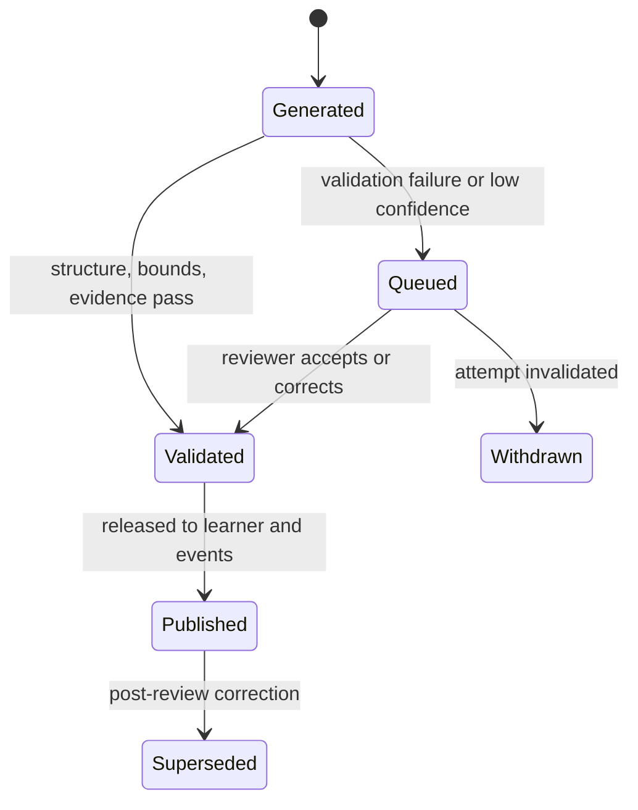

# Examiner Schema v1

Logical schema for the Assessment context. Attempts and evaluations are the product's core evidence records; immutability and provenance rules are strict.

## Entities

| Entity | Key fields | Constraints |
| --- | --- | --- |
| Assessment | `assessmentId`, topicScope, format, scoringPolicy, syllabusVersion, status | Immutable once published; scope must be curated concepts only. |
| AssessmentItem | `itemId`, `assessmentId`, stem, options?, key?, rationale, conceptIds, difficulty | Validated against schema and scope before publication; key required for deterministic items. |
| Rubric | `rubricId`, version, criteria, markRanges, anchors, status | Immutable after publication; calibration results attached before scale use. |
| Attempt | `attemptId`, `learnerId`, `assessmentId`, responses, submittedAt, status | Responses immutable after submission; one active attempt per learner and assessment sitting. |
| Evaluation | `evaluationId`, `attemptId`, rubricVersion?, criterionScores, evidenceRefs, provenance, status | One published evaluation per attempt; supersession requires a recorded reason. |
| ReviewCase | `caseId`, `evaluationId`, reason, reviewer?, resolution | Created on low confidence or validation failure; resolution is auditable. |

## Integrity Rules

1. A published assessment, rubric, or submitted attempt is never edited in place.
2. Every generated item must link to at least one curated concept within the assessment's pinned syllabus version.
3. Deterministic items are scored by code; a model never overrides an answer key.
4. Subjective criterion scores must fall within the rubric's mark range and reference evidence from the learner's answer.
5. An evaluation records full provenance: `ModelRun` for model-drafted parts, reviewer identity for human-validated parts.
6. Evaluations that fail validation are queued, not published; the learner-visible state distinguishes "scored" from "under review".
7. Superseding an evaluation (post-review correction) emits a new `EvaluationPublished.v1` and marks the prior one superseded—consumers must honour the latest.
8. Raw answer bodies never leave the Assessment context on event channels; consumers receive scores, criteria, and concept links.

## Evaluation Lifecycle

## Event Publication

| Event | Trigger |
| --- | --- |
| `AssessmentPublished.v1` | An assessment becomes available to the learner. |
| `AttemptSubmitted.v1` | Responses are frozen for evaluation. |
| `EvaluationPublished.v1` | A validated evaluation is released. |
