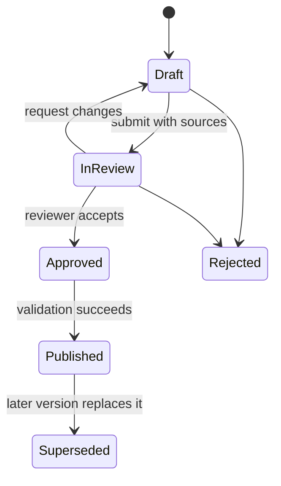

# Knowledge Graph Schema v1

This logical schema defines ownership and constraints; physical storage may begin in PostgreSQL and later project to a graph store without changing its public contracts.

## Entities

| Entity | Key fields | Constraints |
| --- | --- | --- |
| SyllabusVersion | `syllabusVersionId`, name, status, effective dates | Exactly one published version may be default for a given examination scope. |
| SyllabusNode | `nodeId`, parentNodeId, nodeType, label, order | Forms an acyclic hierarchy within a syllabus version. |
| Concept | `conceptId`, canonicalLabel, definition, status | Canonical label is unique within its syllabus version and hierarchy scope. |
| ConceptPlacement | `conceptId`, `nodeId`, placementType | One canonical placement; cross-references are explicit. |
| ConceptRelation | `relationId`, sourceConceptId, targetConceptId, type, rationale | Endpoints exist in compatible syllabus versions; relation-specific constraints apply. |
| SourceReference | `sourceId`, title, publisher, publication date, authority level | Provenance is required before a source can support a curated concept. |
| ConceptSource | `conceptId`, `sourceId`, supportType, locator | Records exact support or illustrative use. |
| GraphChangeSet | `changeSetId`, author, reviewer, status, target version | Published changes are immutable and auditable. |

## Integrity Rules

1. Hierarchy and `PART_OF` relations cannot form cycles.
2. `PREREQUISITE_OF` cannot form a cycle or point from a concept to itself.
3. Symmetric relationships are stored canonically by ordered concept IDs.
4. A deprecated concept remains queryable for historical records but is excluded from new default scopes.
5. A source must not be presented as authoritative beyond its recorded authority level.
6. A published change set cannot be edited; corrections are a later change set.
7. Learner identifiers are prohibited from Knowledge-owned entities.

## Change Lifecycle

## Versioning and Migration

Syllabus versions are immutable after publication. A new UPSC syllabus interpretation, corrected concept, or revised relationship produces a new version or change set rather than an in-place rewrite. Consumers pin a syllabus version for plans, assessments, and reports so historical outputs remain reproducible. Migration mappings identify equivalent, split, merged, or retired concepts; ambiguous mappings require an editorial decision.
