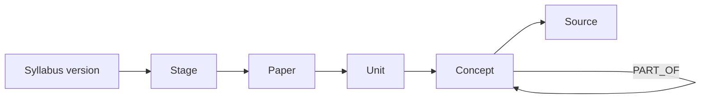

# Knowledge Graph v1

## Purpose

The Knowledge Graph is Lakshya Core's shared, versioned representation of the UPSC curriculum. It enables topic-aware planning, prerequisite-based learning, grounded assessment, and explainable revision recommendations. It is curriculum knowledge, not a store of private learner memory.

## Scope and Boundaries

The Knowledge context owns syllabi, concepts, relationships, source metadata, and editorial status. It does not own learner mastery, notes, chat history, assessment attempts, or model embeddings. Other contexts reference stable concept IDs and a syllabus version through `TopicScope`.

## Graph Model

A syllabus provides the administrative hierarchy: stage, paper, unit, and concept. Typed concept relationships add instructional meaning without replacing that hierarchy. A concept may appear in more than one paper through a scoped cross-reference, but has one canonical identity.

## Concept Record

| Field | Meaning |
| --- | --- |
| `conceptId` | Stable opaque identifier; never encodes a path or label. |
| `syllabusVersion` | Version in which the concept definition is valid. |
| `canonicalLabel` | Editorially approved display name. |
| `aliases` | Search and ingestion synonyms; never create duplicate concepts. |
| `definition` | Concise, learner-facing meaning. |
| `hierarchyPath` | Stage, paper, and unit placement. |
| `editorialStatus` | Draft, curated, deprecated, or retired. |
| `sourceReferences` | Authoritative source provenance. |
| `validFrom` / `validTo` | Temporal validity for syllabus changes. |

## Relationship Types

| Type | Direction | Meaning | Rules |
| --- | --- | --- | --- |
| `PART_OF` | child → parent | Concept belongs to a broader concept. | Acyclic within a syllabus version. |
| `PREREQUISITE_OF` | foundation → dependent | Understanding the source materially supports the target. | Acyclic; evidence and editorial rationale required. |
| `RELATED_TO` | symmetric | Concepts are useful to study together. | Stored once; exposed bidirectionally. |
| `APPLIES_TO` | principle → context | A principle is applied within a topic or case. | Not a substitute for a prerequisite. |
| `CONTRASTS_WITH` | symmetric | Concepts are often compared in UPSC answers. | Stored once; rationale required. |
| `SUPPORTED_BY` | concept → source | A source substantiates a concept. | Source must have provenance and citation metadata. |

## Query Contracts

| Consumer | Required query | Result |
| --- | --- | --- |
| Planner | Expand a goal into a valid topic scope | Concepts ordered by hierarchy and prerequisites. |
| Learning Engine | Find prerequisites and related concepts | Concept cards with relationship rationale. |
| Examiner | Validate assessment scope | Curated concepts and permitted sources only. |
| Revision | Find high-value neighbouring concepts | Explainable revision candidates, never a learner score. |
| Retrieval | Filter source search by concept scope | Stable concept IDs and source references. |

The graph returns curated facts and relation rationales; each consuming context combines them with its own learner data and policy.

## Editorial Governance

Graph writes require a curated change set with author, reviewer, source references, and target syllabus version. Automated extraction may propose concepts or relations but cannot publish them. Deprecation retains historical identifiers and maps replacements where an editorially sound successor exists. Publishing validates identifiers, hierarchy integrity, relationship constraints, and source references.

## Quality and Success Metrics

Measure taxonomy coverage against the published syllabus, duplicate-concept rate, invalid-relation rejection rate, editorial turnaround time, and the percentage of plan, quiz, and revision recommendations that can cite their graph path. Graph completeness is not measured by edge count; inaccurate edges are worse than missing edges.
