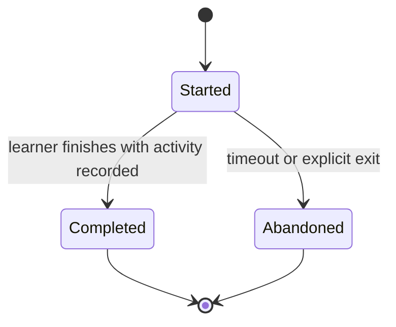

# Learning Engine v1

## Purpose

The Learning Engine delivers and records purposeful study activity. It turns plan commitments into sessions, grounds AI explanations in curated sources, and converts what happened during study into evidence other modules can trust. It owns the Learning context of the domain model: StudySession, LearningResource, and ProgressObservation.

## Scope and Boundaries

Learning owns observed activity and its evidence. It does not own plans (Planning), mastery labels (derived downstream from evidence), curriculum facts (Knowledge), or durable learner context (Memory). It may report that a commitment was worked on, but only Planning mutates the plan.

## Session Lifecycle

A session references at most one StudyCommitment and a validated `TopicScope`. Completion publishes `StudySessionCompleted.v1`; evidence-bearing activity additionally publishes `ProgressObserved.v1`. Abandoned sessions are kept as activity data but generate no progress observations.

## Grounded Explanation Pipeline

When a learner asks for teaching help inside a session, the engine follows a retrieval-first pipeline:

1. **Scope resolution** — resolve the question to concepts via the Knowledge Graph; reject or flag out-of-syllabus scope.
2. **Context assembly** — retrieve curated source passages for those concepts and purpose-limited learner context from the Memory Engine.
3. **Generation** — the model explains using the assembled context, with citations to source references.
4. **Validation** — responses must cite retrieved sources for factual claims; uncited claims are marked as unverified before display.

Model output is presentation, not content: an explanation is never stored as a LearningResource and never becomes curriculum fact. Sources remain the authority.

## Progress Observations

| Field | Meaning |
| --- | --- |
| `observationId` | Stable identifier for the evidence item. |
| `sessionId` | Session in which the evidence arose. |
| `conceptIds` | Concepts the observation is about, from the session's topic scope. |
| `signal` | A `MasterySignal` value object: evidence, confidence, recency. |
| `basis` | What produced it: self-report, exercise result, explanation interaction. |
| `provenance` | Actor or model run that generated the observation. |

Observations are append-only evidence. They never directly set a mastery level; Analytics and Revision derive their own views from the stream.

## Query Contracts

| Consumer | Request | Result |
| --- | --- | --- |
| Planner | Activity and coverage for a horizon | Sessions and observed concepts against commitments. |
| Revision | Recent evidence for a concept set | Observations with recency and confidence. |
| Analytics | Activity stream | Session and observation events, idempotently consumable. |
| Learner | Session history | Own sessions, resources used, and observations with provenance. |

## Quality and Success Metrics

Measure the share of explanations whose factual claims carry citations, out-of-scope question rate, observation coverage (sessions that produced evidence vs. silent sessions), correction rate on observations, and time from session completion to event publication. An engine that records hours but produces no usable evidence is failing regardless of engagement numbers.
