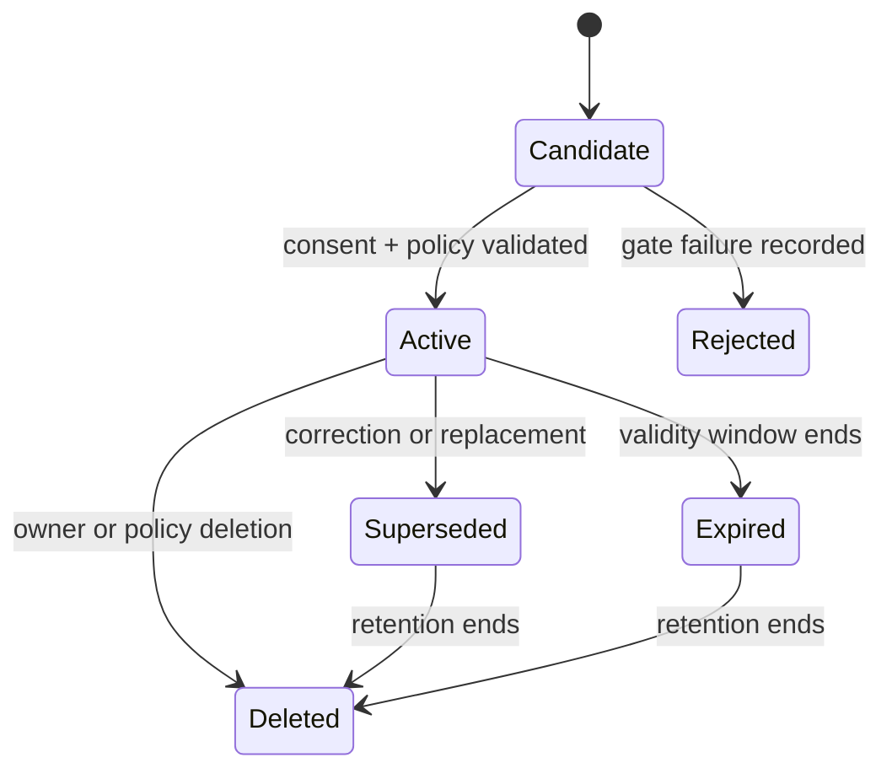

# Memory Engine Schema v1

This logical schema defines ownership and constraints; physical storage begins in PostgreSQL with pgvector, and a dedicated vector store later would be an infrastructure change, not a contract change.

## Entities

| Entity | Key fields | Constraints |
| --- | --- | --- |
| MemoryRecord | `memoryId`, `learnerId`, recordType, content, confidence, status | Tenant-scoped; requires provenance, consent basis, and purpose restrictions before activation. |
| MemoryRevision | `revisionId`, `memoryId`, sequence, content, changedBy, reason | Append-only; the latest revision is the presented content. |
| MemoryCorrection | `correctionId`, `memoryId`, correctedContent, learner rationale | Supersedes the target record; corrections are themselves auditable records. |
| RetrievalPolicy | `policyId`, purpose, allowed record types, ranking weights, context budget | Versioned; every retrieval logs the policy version it used. |
| EmbeddingChunk | `chunkId`, `memoryId`, model, vector, indexedAt | Derived data; deleted or rebuilt whenever its source record changes. |
| MemoryAuditEntry | `auditId`, `memoryId`, action, actor, occurredAt | Records activation, retrieval-policy changes, correction, and deletion. |

## Integrity Rules

1. A record cannot activate without provenance, a consent basis, and at least one permitted purpose.
2. `learnerId` is mandatory on every Memory-owned entity; cross-learner queries are prohibited.
3. Embeddings are derived: no embedding may outlive, contradict, or substitute for its source record.
4. A superseded record is excluded from retrieval but remains inspectable by its owner until retention ends.
5. Deletion must propagate to revisions, embeddings, and caches, and propagation completion is recorded in the audit trail.
6. Retrieval responses may only contain records whose consent basis covers the requesting purpose.
7. Knowledge Graph concept IDs may be referenced for scoping, but curriculum facts are never stored as learner memory.

## Record Status Lifecycle

## Versioning and Deletion

Content changes append a `MemoryRevision`; records are never edited in place. Consent revocation expires every record that depended on the revoked basis. Deletion is a verified workflow: the engine publishes `MemoryRecordDeleted.v1`, removes derived embeddings, invalidates cached context, and writes an audit entry only when all steps complete. Retention windows are defined per record type before that type is collected, as required by the architecture's security posture.
