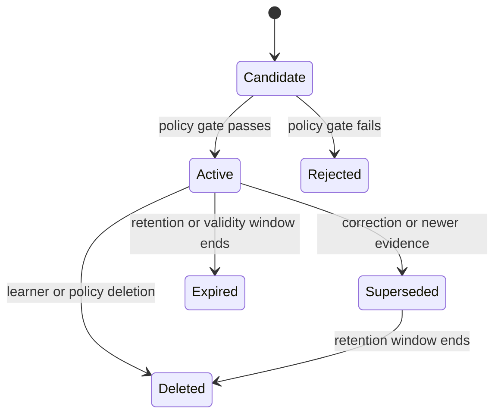

# Memory Engine v1

## Purpose

The Memory Engine is Lakshya Core's consent-aware store of durable learner context. It turns study activity, assessment evidence, corrections, and stated preferences into explicit, retrievable records so that every module can personalise its behaviour without re-deriving the learner from chat history. It implements the layered memory model accepted in ADR-0003.

## Scope and Boundaries

The Memory context owns memory records, corrections, retrieval policy, and the derived embedding index. It does not own the shared syllabus (Knowledge), plans (Planning), attempts or evaluations (Assessment), or identity and consent grants (Identity). Other contexts receive retrieved context through a query contract; they never read Memory tables directly.

## Memory Taxonomy

| Record type | Example | Primary source |
| --- | --- | --- |
| Preference | Prefers evening study blocks; Hindi-medium explanations. | Learner statement or settings change. |
| Goal context | Targets CSE 2027 with Sociology optional. | Planning events and learner confirmation. |
| Verified fact | Completed Polity foundation course in June 2026. | Learner assertion with corroborating activity. |
| Learning observation | Repeatedly confuses Fundamental Rights with DPSP. | `ProgressObserved.v1`, `EvaluationPublished.v1`. |
| Interaction context | Open follow-up from the last mentoring exchange. | Short-term; expires with the session or task. |

Every record carries `Provenance`, a confidence level, a `ConsentBasis`, and purpose restrictions. A record type never widens the purposes its consent basis allows.

## Record Lifecycle

Writes are event-driven: the engine consumes `StudySessionCompleted.v1`, `ProgressObserved.v1`, `EvaluationPublished.v1`, and `RevisionCompleted.v1`, and proposes candidate records. A policy gate checks consent, purpose, duplication, and minimum evidence before activation. Activation publishes `MemoryRecordActivated.v1`; deletion publishes `MemoryRecordDeleted.v1` and must propagate to every derived representation.

## Retrieval Pipeline

Retrieval combines deterministic filters with semantic search, in that order:

1. **Scope filters** — tenant, consent basis, purpose of the request, record status, and optional `TopicScope`.
2. **Candidate search** — lexical match and vector similarity over eligible records only.
3. **Ranking** — relevance, recency, confidence, and record-type priority for the requesting purpose.
4. **Context assembly** — a bounded, purpose-limited context package in which every item carries provenance and confidence.

Callers can therefore cite or discount each retrieved item. The engine returns the minimum context that satisfies the request; it never returns raw event payloads or another context's records.

## Query Contracts

| Consumer | Request | Result |
| --- | --- | --- |
| Secretary | Context for the current conversation turn | Preferences, open follow-ups, recent salient observations. |
| Planner | Constraints and history for a planning horizon | Availability preferences, goal context, sustained observations. |
| Learning Engine | Learner context for a topic scope | Prior difficulties, preferred explanation style, related observations. |
| Examiner | Evidence profile for assessment calibration | Mastery-relevant observations with confidence; never raw scores it does not own. |
| Learner (self-service) | Inspect stored memory | Every active and superseded record with provenance and controls. |

## Learner Controls

Learners can inspect all retained records, correct them, and delete them. A correction creates a `MemoryCorrection`, supersedes the disputed record, and activates the corrected replacement; the engine must not resurface superseded content. Deletion removes the record, its embeddings, and its presence in any cached context, and the propagation is verified, not assumed.

## Consolidation (Deferred)

Background consolidation—summarising repeated low-level observations into bounded, evidence-linked records—is deferred until retrieval quality can be measured. Its constraints are fixed now by ADR-0003: consolidated records link to their evidence, respect corrections, and are reversible through versioned history.

## Quality and Success Metrics

Measure retrieval precision against learner feedback, correction rate per record type, deletion-propagation latency, share of AI requests whose context items all carry provenance, and the rate at which policy gates reject candidate writes. A growing memory store is not success; retrieved-and-useful context is.
