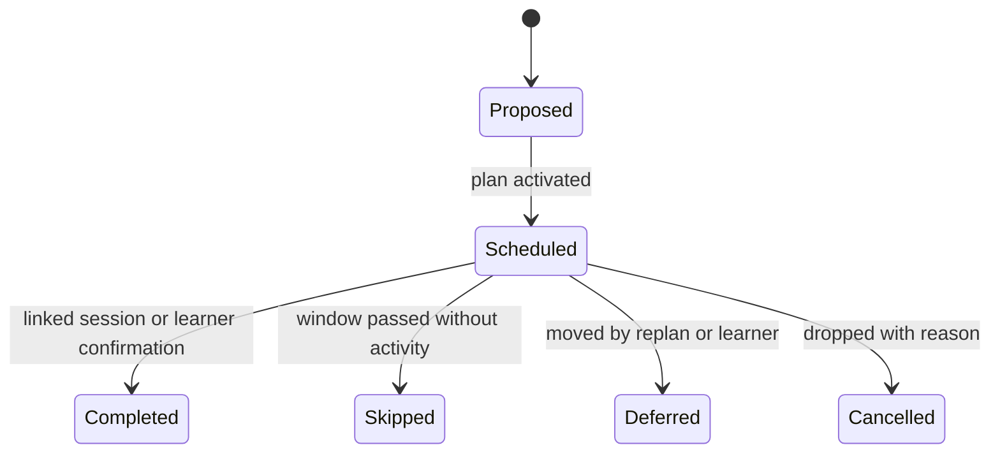

# Planner Schema v1

Logical schema for the Planning context. Plans are versioned documents with relational commitment rows; both live in PostgreSQL.

## Entities

| Entity | Key fields | Constraints |
| --- | --- | --- |
| Goal | `goalId`, `learnerId`, statement, targetDate?, status | Measurable outcome or explicit open-ended flag; owned by one learner. |
| StudyPlan | `planId`, `learnerId`, `goalIds`, horizon, policyVersion, syllabusVersion, status | At most one active plan per learner and horizon; immutable once active. |
| PlanRevision | `planId`, supersededByPlanId, reason, diffSummary | Links plan versions; every supersession records its trigger. |
| StudyCommitment | `commitmentId`, `planId`, topicScope, timeBudget, window, status, rationale | Belongs to one plan; carries the rule or actor that placed it. |
| AvailabilityWindow | `windowId`, `learnerId`, recurrence, capacity | Learner-stated capacity; consent-scoped when sourced from Memory. |
| ReplanDecision | `decisionId`, `planId`, trigger, outcome, actor | Audit of accepted and rejected replan proposals. |

## Integrity Rules

1. An active plan cannot be edited; changes occur through a superseding version.
2. Commitment windows must fit within the plan horizon and the learner's stated availability.
3. Every commitment references a validated `TopicScope` pinned to the plan's syllabus version.
4. Unresolved commitments from a superseded plan must be explicitly carried, rescheduled, or dropped with a reason—never silently lost.
5. AI-proposed changes are stored as proposals until accepted by the learner or an authorised policy; the accepting actor is recorded.
6. Replan frequency per learner is bounded by policy version; the bound itself is versioned.
7. Plans reference goals but never embed another context's private data.

## Commitment Lifecycle

## Event Publication

| Event | Trigger |
| --- | --- |
| `GoalActivated.v1` | Goal transitions from draft to active. |
| `StudyPlanPublished.v1` | Plan version becomes active. |
| `StudyCommitmentScheduled.v1` | Commitment enters a schedule window. |

## Reproducibility

A plan can be regenerated from its inputs: goals, availability, syllabus version, evidence snapshot, and policy version are all pinned on the plan record. This makes planner behaviour testable and lets a learner-facing "why this plan" view cite real inputs rather than a post-hoc explanation.
