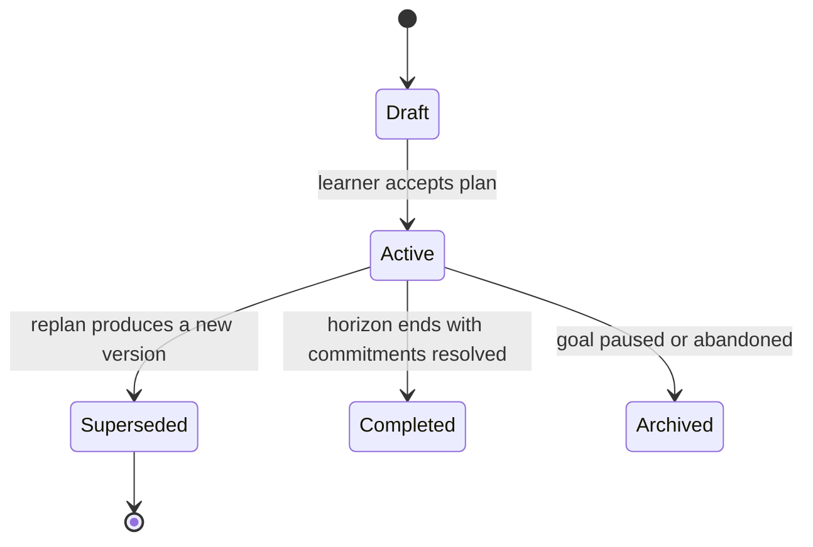

# Planner v1

## Purpose

The Planner converts learner goals and real-world constraints into adaptable study plans. It owns the Planning context: Goal, StudyPlan, and StudyCommitment. Its job is not to produce an ideal schedule once, but to keep a workable plan alive as availability, progress, and performance change.

## Scope and Boundaries

Planning owns goals, plans, commitments, and replanning decisions. It does not own study activity (Learning), assessment outcomes (Assessment), revision scheduling policy (Revision), or the syllabus (Knowledge). It consumes their events and read models; they cannot mutate a plan.

## Planning Inputs

| Input | Source | Use |
| --- | --- | --- |
| Goals and target dates | Learner via Identity-scoped commands | Define the outcome a plan serves. |
| Availability and preferences | Memory Engine (consent-scoped) | Bound daily and weekly `TimeBudget`. |
| Syllabus coverage | Knowledge Graph `TopicScope` expansion | Order topics by hierarchy and prerequisites. |
| Progress evidence | `StudySessionCompleted.v1`, `ProgressObserved.v1` | Detect drift between plan and reality. |
| Performance insights | `InsightProduced.v1`, `EvaluationPublished.v1` | Rebalance weightage toward weak areas. |
| Learner edits | Direct plan commands | Human intent always wins. |

## Plan Lifecycle

Plans are immutable once active. Replanning creates a new plan version that supersedes the old one, carrying forward unresolved commitments explicitly (kept, rescheduled, or dropped with a reason). At most one plan is active per learner and horizon. Publication emits `StudyPlanPublished.v1`; each scheduled commitment emits `StudyCommitmentScheduled.v1`.

## Scheduling Policy

Scheduling is deterministic: given the same goals, constraints, syllabus version, and policy version, the Planner produces the same plan. AI assists at the edges—drafting goal decomposition, suggesting prioritisation, explaining trade-offs—but its suggestions enter the plan only through the same validation as a learner edit. Every commitment records why it exists: the goal, concepts, and policy rule that placed it.

## Replanning Triggers

| Trigger | Response |
| --- | --- |
| Sustained under- or over-completion | Propose horizon rebalance; never silently compress topics. |
| New performance insight | Adjust topic weightage within policy bounds. |
| Availability change | Recompute schedule; preserve commitment intent. |
| Learner edit | Apply immediately; record as learner-authored. |
| Syllabus version change | Flag affected commitments for explicit migration. |

Replans are rate-limited by policy so the plan remains stable enough to follow. Learners always see what changed between versions and why.

## Query Contracts

| Consumer | Request | Result |
| --- | --- | --- |
| Secretary | Today's agenda | Due commitments with time budgets and scope. |
| Learning Engine | Commitment for a starting session | Commitment identity, topic scope, time budget. |
| Notification | Upcoming commitments | Schedule facts for reminder requests. |
| Analytics | Plan adherence data | Plan versions and commitment resolution events. |

## Quality and Success Metrics

Measure commitment completion rate, plan half-life (time until a replan is needed), replan churn per learner-week, the share of plan changes that are learner-authored versus system-proposed, and whether every commitment can cite its goal and placement rationale. A plan that is technically optimal but abandoned in a week is a planner failure.
