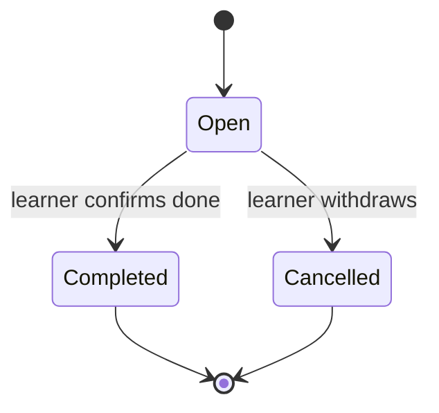

# Secretary Schema v1

Logical schema for the Secretary's administrative state. Everything else the Secretary shows is a read model over other contexts' data and is never persisted here.

## Entities

| Entity | Key fields | Constraints |
| --- | --- | --- |
| Task | `taskId`, `learnerId`, title, note?, dueAt?, status | Tenant-scoped; title required; due dates are learner-local times stored as UTC with zone. |
| FollowUp | `followUpId`, `learnerId`, awaitedCorrelationId, description, expiresAt, status | Resolves automatically on the awaited event or expires with learner notice. |
| ReminderRequest | `reminderId`, subjectType, subjectId, requestedFor, channelPreference? | References a Task or FollowUp; delivery is owned by Notification. |
| IntentLog | `intentId`, `learnerId`, utteranceRef, resolvedCommand?, outcome, modelRun? | Audit of intent resolution; raw utterances stored under short-term retention. |

## Integrity Rules

1. The Secretary never stores copies of plans, sessions, assessments, or memory records; agenda views resolve them at read time.
2. A resolved intent must map to a typed command in the owning module's contract; free-form writes are prohibited.
3. Ambiguity below the confidence threshold produces a clarification, and the clarification exchange is logged with the final resolution.
4. Follow-ups must reference a correlation ID; orphaned follow-ups are expired, not silently kept.
5. Reminder timing preferences are passed to Notification; the Secretary does not implement delivery, deduplication, or quiet hours.
6. Intent logs retain model run metadata for quality measurement but purge raw utterances on the short-term retention schedule.

## Task Lifecycle

## Event Publication

| Event | Trigger |
| --- | --- |
| `TaskCaptured.v1` | A task is recorded from conversation or direct entry. |
| `TaskCompleted.v1` | A task reaches completed status. |
| `FollowUpResolved.v1` | An awaited action's event arrived or the follow-up expired. |
