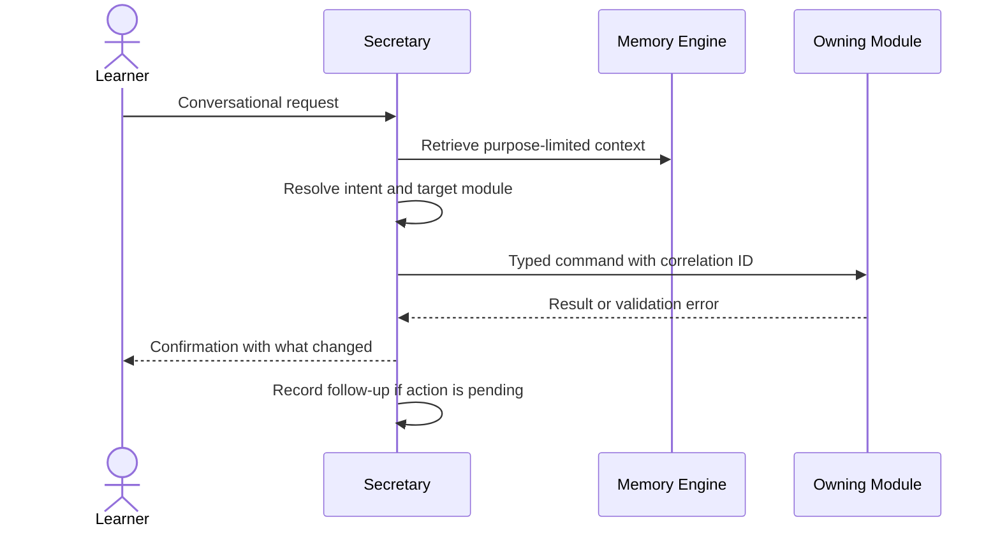

# Secretary v1

## Purpose

The Secretary is the learner's administrative front door. It turns conversational intent into concrete actions in the owning modules, keeps track of tasks and follow-ups that fall outside the study plan, assembles the daily agenda, and requests reminders. It is the module that makes Lakshya Core feel like a person who follows through.

## Scope and Boundaries

The Secretary owns only administrative state: tasks, follow-ups, and agenda composition. It orchestrates every other capability without owning any of it—plans belong to Planning, sessions to Learning, assessments to Assessment, memory to Memory. When a learner says "move tomorrow's Polity session to the evening," the Secretary resolves intent and issues a command to the Planner; it never edits the plan itself.

## Intent Handling

Intent resolution may use a model, but the output of resolution is a typed command validated by the owning module—never a free-form state change. Ambiguous intent produces a clarifying question, not a guess with side effects. Every action confirmation states what changed, so conversational operation stays as auditable as a form.

## Tasks and Follow-Ups

| Record | Meaning | Examples |
| --- | --- | --- |
| Task | Learner-owned administrative to-do outside the study plan | Fill the DAF form; collect category certificate; renew test-series login. |
| Follow-Up | System-owed pending action the Secretary must chase | Awaiting evaluation result; a deferred question to revisit; an unconfirmed replan proposal. |

Tasks have a lifecycle of open → completed or cancelled, an optional due date, and an optional reminder request. Follow-ups reference the correlation ID of the awaited action and resolve automatically when the corresponding event arrives. Capturing a task publishes `TaskCaptured.v1`; completion publishes `TaskCompleted.v1`.

## Agenda Composition

The daily agenda is a read model composed from owned and referenced data: due study commitments (Planning), due revision items (Revision), open tasks and follow-ups (Secretary), and pending assessments (Assessment). The Secretary orders and presents; it does not copy the underlying records, so the agenda can never disagree with the owning module.

## Query Contracts

| Consumer | Request | Result |
| --- | --- | --- |
| Learner | Today's agenda | Ordered commitments, revision items, tasks, follow-ups with sources. |
| Notification | Reminder requests | Task and follow-up reminder facts with preferences applied downstream. |
| Analytics | Administrative activity | Task and follow-up lifecycle events. |

## Quality and Success Metrics

Measure intent-resolution accuracy against learner confirmations, clarification rate (asked vs. guessed), follow-up resolution latency, agenda accuracy complaints, and the share of conversational actions that produced a correctly-typed command on the first attempt. A secretary that acts fast but on the wrong intent is worse than one that asks.
